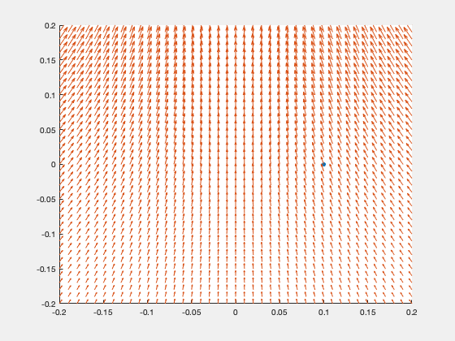

# Optical_simulation

[hw2](#hw2)\
[hw3](#hw3)\
[hw4](#hw4)\
[hw5](#hw5)\
[hw6](#hw6)

## Introduction and brief results
### hw2
* Introduction\
  draw my own self-portrait using MATLAB.
* Result\
   </img>

### hw3
* Introduction\
  Simulation of rock slides down from moutain.
  Collaborator: Ashish, Steven
* Result\
  [hw3_folder](./Optical_simulation_hw/hw3)\
  

### hw4
* Introduction\
  In space, there are two objects, a triangular magnet with 100 volts and a circular object with 0 volts.\
  To simulate the electromagnetic field in space, and to represent it using a graph.
* Result\
  [hw4_folder](./Optical_simulation_hw/hw4)\
  
  

### hw5
* Introduction\
  Simulate the movement of an electron in a time-varying magnetide field.
* Result
  [hw5_folder](./Optical_simulation_hw/hw5)\
  

### hw6
* Introduction\
  Ray tracing is a computer graphics technique used to generate realistic images by simulating the way light interacts with objects in a scene.\
  It is a rendering process that traces the path of light rays as they travel through a virtual 3D environment, interact with objects, and ultimately reach the viewer's eye or the camera sensor.\
  The process is highly detailed and computationally intensive, but it produces stunningly lifelike images with realistic lighting, shadows, reflections, and refractions.\
  In this problem, I modified the basic code provide by Bo-Ting, Shen and simulate different shape(sphere of different number, plane, triangle).\
  With this code, we can simply change the direction of light and view this shape under different view angle. And the most importance, we can generate any real-world thing.\
* Result 
  [hw6_folder](./Optical_simulation_hw/hw6)\
  
  
  
  
